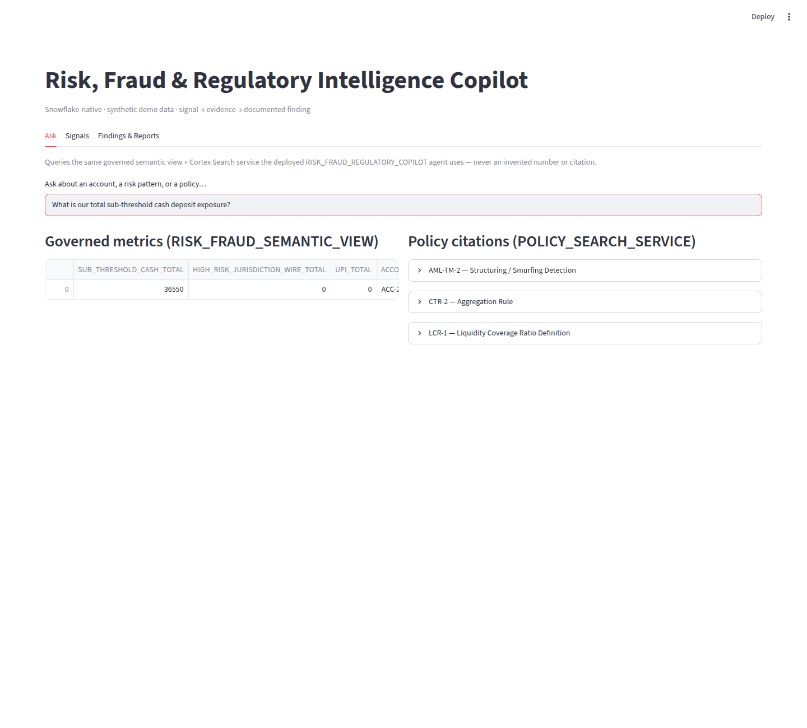
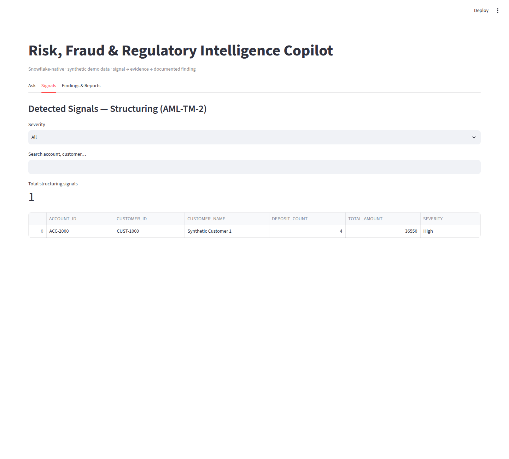
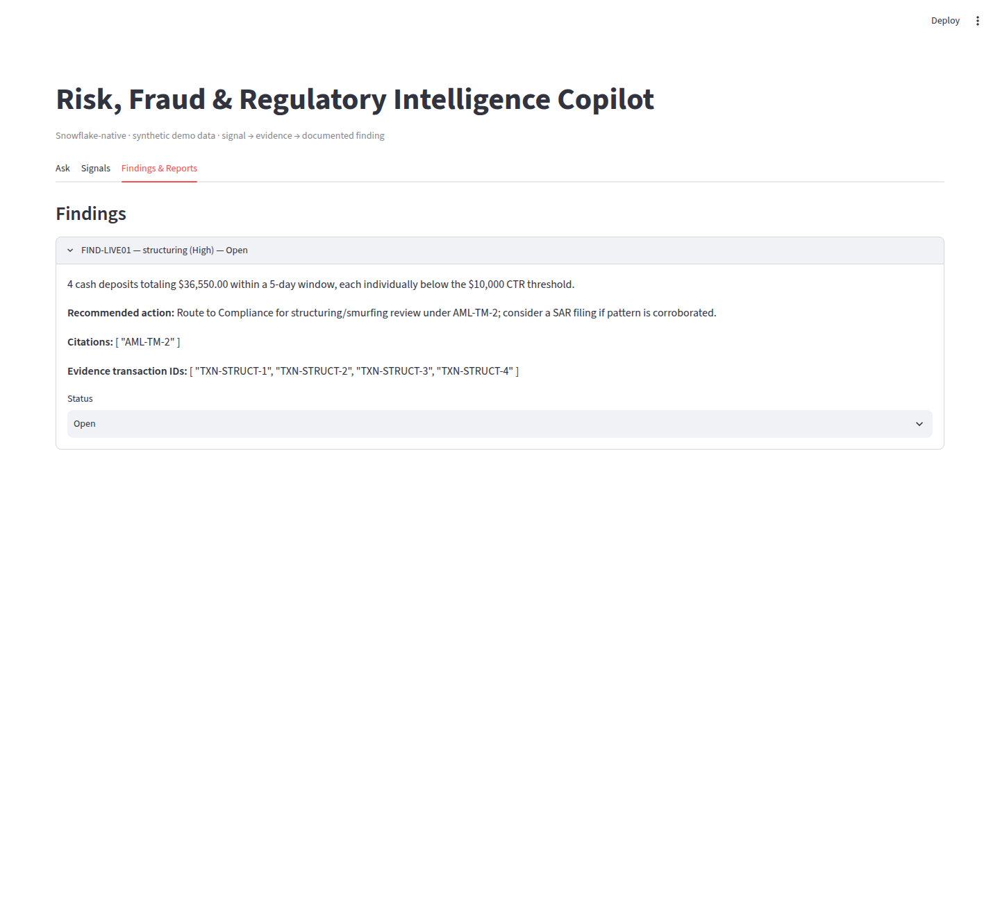

# Streamlit app screenshots

Screenshots of the Track 1 Streamlit-in-Snowflake app, one per tab. Every screenshot shows
**live data from the real Snowflake account** (semantic view, Cortex Search service, and
the `FINDINGS` table) and matches the values documented in
`tracks/risk_fraud_copilot/coco/README.md` ("Live Pilot Results").

## How these were captured (read this first)

The app is deployed to Snowsight with `snow streamlit deploy`, but Snowsight requires an
interactive, MFA-capable login that a headless browser can't do. So each screenshot is the
**identical `05_streamlit_app.py` file, unmodified**, run locally with `streamlit run` against
the **same live account**: `capture/runner.py` opens a Snowpark session (connection
`cococlihack`, the track's database, schema `CORE`, warehouse `COMPUTE_WH`) so that
`get_active_session()` in the app returns it, then `capture/shot.py` drives the page with
Playwright/Chromium. The only visible differences from Snowsight are the "Deploy" menu in the
top bar and the Streamlit version's default styling.

```bash
python -m venv env && env/bin/pip install streamlit snowflake-snowpark-python playwright
APP_PATH=tracks/risk_fraud_copilot/coco/05_streamlit_app.py SF_DB=RISK_FRAUD_COPILOT \
  env/bin/streamlit run docs/screenshots/streamlit/capture/runner.py --server.port 8601 --server.headless true
env/bin/python docs/screenshots/streamlit/capture/shot.py 8601 risk_fraud \
  "01_ask|Ask|ask:What is our total sub-threshold cash deposit exposure?" "03_findings|Findings & Reports|expand"
```

(`shot.py` hardcodes this environment's Chromium path; adjust `executable_path` if yours differs.)

## 1. Risk, Fraud & Regulatory Intelligence Copilot

Deployed app: `RISK_FRAUD_COPILOT.CORE.RISK_FRAUD_STREAMLIT_APP` · source: `tracks/risk_fraud_copilot/coco/05_streamlit_app.py`

| Tab | Screenshot | What it shows |
|---|---|---|
| Ask |  | Live semantic-view metrics (`sub_threshold_cash_total` = **36,550** for the structuring account) next to `POLICY_SEARCH_SERVICE` citations (AML-TM-2, CTR-2). |
| Signals |  | The structuring (AML-TM-2) detector run live, with severity/search filters. |
| Findings & Reports |  | `FIND-LIVE01` expanded: narrative, citations, evidence transaction IDs, and a status dropdown that writes back to `FINDINGS`. |

## Note

The Findings tab escapes `$` in narratives. Streamlit otherwise treats paired dollar signs as LaTeX
and swallows the amounts; this was found by rendering the page, not by the earlier query checks.
